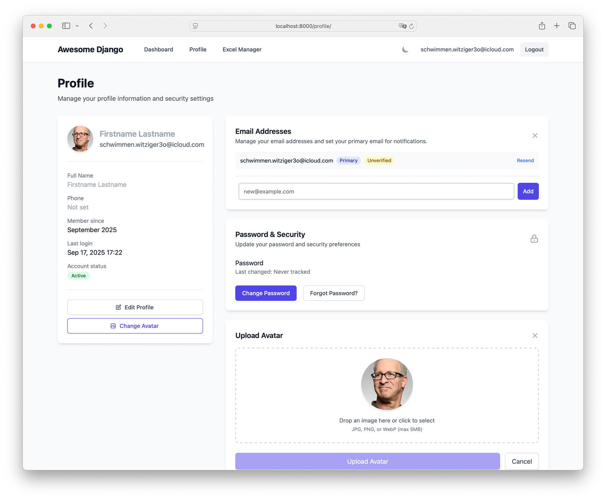
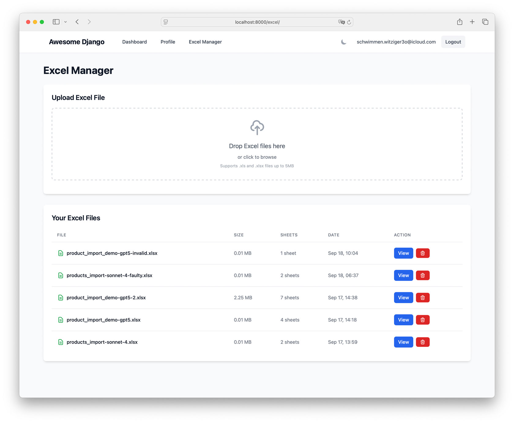
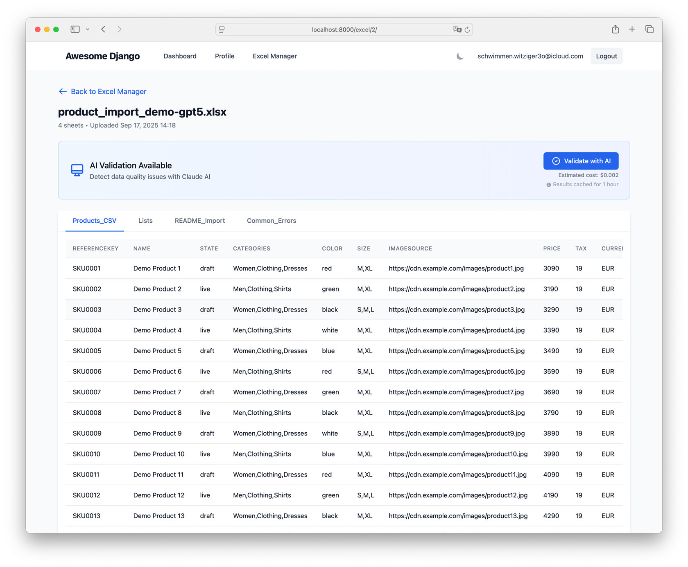
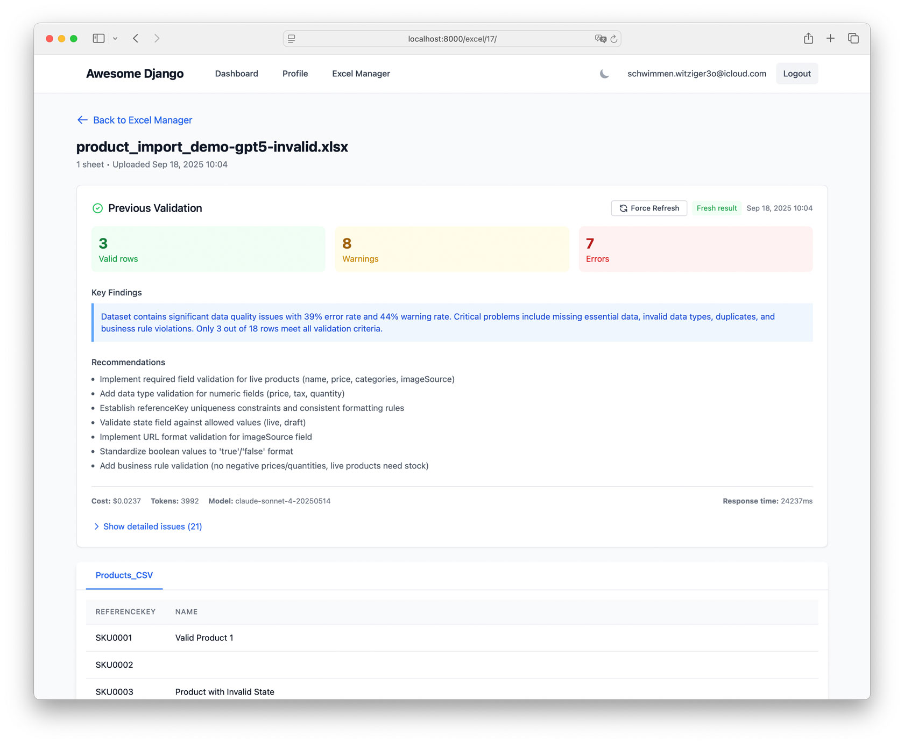

# Django Excel AI Validator

> A Rails developer's journey into Django, featuring production-ready HTMX patterns and AI-powered Excel validation

Modern Django 5.1 application demonstrating clean architecture, hypermedia-driven development, and practical AI integration with 625x ROI vs manual review.

| User Profile                                  | Excel Manager                                   | Excel Manager - Excel Detail                   | Excel Manager - AI Validation                  |
| --------------------------------------------- | ---------------------------------------------- | --------------------------------------------- | --------------------------------------------- |
|  |  |  |  |

## 📁 Project Structure

For a comprehensive overview of the codebase organization, see [Project Structure Documentation](docs/project-structure.md).

## 🚀 Quick Start

### DevContainer (Recommended)

```bash
# Clone and open in VS Code
git clone https://github.com/aindy-eu/django-excel-ai.git
cd django-excel-ai

# Setup environment (required for DevContainer)
cp .env.example .env
# Edit .env to add your ANTHROPIC_API_KEY if you want AI features

code .

# Reopen in Container (Cmd+Shift+P → "Reopen in Container")
# PostgreSQL database will start automatically via Docker Compose
# Then run inside the container:
./dev-start.sh
```

Visit http://localhost:8000

### Local Development

**Prerequisites:**
- Python 3.11+
- PostgreSQL 12+ (running and accessible)
- Node.js 18+ (for Tailwind CSS)
- System dependency: `libmagic1` (for file type detection)

```bash
# Install system dependencies (Ubuntu/Debian)
sudo apt-get install libmagic1 postgresql-client

# Install Python dependencies
pip install -r requirements/development.txt

# Install Node.js dependencies
cd static_src && npm install && cd ..

# Setup database and environment
cp .env.example .env
# Edit .env with your PostgreSQL credentials
python manage.py migrate

# Create admin user (email-based)
python manage.py createsuperuser

# Start development
./dev-start.sh
```

## 📧 Authentication

This project uses **email-based authentication** (no usernames):

- Login with: `admin@example.com` / `admin123` (dev only)
- Custom User model in `apps/users/`
- Django Allauth integration

## 📚 Documentation

Comprehensive documentation available in [`/docs/`](./docs/README.md):

- **[Docs README](./docs/README.md)** - Docs entrypoint
- **[Rails to Django Guide](./docs/rails-to-django.md)** - Translation guide for Rails developers
- **[HTMX Production Patterns](./docs/frontend/htmx-patterns.md)** - Battle-tested patterns from real features
- **[Architecture](./docs/architecture.md)** - Clean architecture and design decisions
- **[AI Integration](./docs/claude-sdk/)** - Claude SDK integration with cost optimization
- **[Development](./docs/development.md)** - Setup and workflow
- **[Testing](./docs/testing/)** - 86% coverage with pytest

## 🏗️ Tech Stack

- **Django 5.1** - Modern Python web framework
- **PostgreSQL** - Production database
- **HTMX + Alpine.js** - Hypermedia-driven, no build step
- **Tailwind CSS 3.4** - Utility-first CSS
- **Django Allauth** - Email-based authentication
- **Claude AI SDK** - AI-powered Excel validation
- **Docker** - Containerized development

## 🛠️ Common Commands

```bash
python manage.py runserver           # Start Django
cd static_src && npm run dev         # Watch Tailwind
pytest apps/<app>/                   # Run tests
python manage.py makemigrations      # Create migrations
```

## 📁 Project Structure

```
apps/               # Django applications
├── authentication/ # Allauth integration
├── core/           # Core utilities
├── dashboard/      # Main application
├── excel_manager/  # Excel upload & AI validation
└── users/          # Custom User model

static_src/         # Tailwind CSS source
templates/          # Django templates
libs/               # Pure Python utilities
docs/               # Full documentation
```

See [architecture docs](./docs/architecture.md) for complete structure.

## 🔧 Environment Variables

Copy `.env.example` to `.env` and configure:

- Database credentials
- Secret key
- Debug mode
- Email settings
- AI features (optional)

## 🤖 AI Features (Claude SDK)

The project includes integration with Anthropic's Claude AI SDK for AI-powered features.

### Setup

1. **Get API Key**: Obtain from [Anthropic Console](https://console.anthropic.com/)
2. **Configure**: Add to `.env`:
   ```env
   ANTHROPIC_API_KEY=sk-ant-...
   AI_FEATURES_ENABLED=True
   CLAUDE_MODEL=claude-sonnet-4-20250514
   CLAUDE_MAX_TOKENS=1000
   ```
3. **Test Connection**:
   ```bash
   python manage.py test_ai
   ```

### Usage

The AI service is available through `apps.core.services.ai_service.AIService`:

```python
from apps.core.services.ai_service import AIService

service = AIService()
result = service.send_message("Your prompt here")
if result['success']:
    print(result['content'])
```

## 🚢 Production

See [technical documentation](./docs/technical.md#production) for deployment guidelines.

## 🎯 Why This Project Exists

Born from a job interview challenge with the cryptic hint: "take a look at Excel." What began as a simple demo transformed into a comprehensive exploration of translating Rails expertise into Django mastery.

This project represents the journey of a Rails developer discovering Django's strengths while maintaining architectural principles that work across frameworks:

- **Modern Django without React/Vue** - HTMX + Alpine.js for 95% less complexity
- **AI that pays for itself** - 625x ROI with intelligent caching (82% cost reduction)
- **Production patterns** - Not theoretical, but battle-tested from real features
- **Clean architecture** - Service layers, proper testing, environment-based config
- **Cross-framework architecture** - Rails principles successfully applied to Django
- **Complete developer experience** - From DevContainer to deployment

## 📈 Key Features

### Excel AI Validation

- Upload Excel files via drag-and-drop
- AI-powered data quality analysis in < 3 seconds
- Smart caching reduces API costs by 82%
- Shows actual costs and tokens used
- Force refresh for fresh validation

### Production HTMX Patterns

- Server-side state management (no sync issues)
- Loading states with disabled buttons
- Partial template organization
- Graceful degradation
- CSRF protection that just works

### Developer Experience

- 86% test coverage with pytest
- Management commands for testing
- Comprehensive error handling
- Docker DevContainer support
- Modern Python tooling (Black, Ruff, mypy)

## 📊 Performance Metrics

| Operation              | Time   | Cost   | Savings |
| ---------------------- | ------ | ------ | ------- |
| Manual Excel Review    | 15 min | $12.50 | -       |
| AI Validation (First)  | 2.1s   | $0.021 | 99.8%   |
| AI Validation (Cached) | 50ms   | $0.000 | 100%    |

## 🤝 About This Project

This project serves as a demonstration and learning resource, showcasing:

- How to integrate AI without breaking the bank
- HTMX patterns that actually work in production
- Clean Django architecture from a Rails perspective
- Practical examples over theoretical concepts

**Note:** This is a portfolio/demo project created to showcase Django development skills and architectural patterns. While the code is open for learning and reference, it's not actively seeking contributions.

## 💎 Hidden Gems

This project contains more than just Django code.

### For the Curious Developer

Try this command with your AI assistant:

```text
Please read these files to understand how this project was built:

- .claude/scruaim/README.md - The framework that guided development
- .claude/scruaim/user-stories/todo/US-011-explain-scruaim-framework.md - How to explore the framework
- .claude/scruaim/user-stories/todo/US-012-explain-ai-handovers.md - Understanding session continuity
- .claude/scruaim/user-stories/todo/US-013-explain-slash-commands.md - Deep analysis tools

Use multiple agents if needed. Complete the exploration and create the documentation in docs/tools/
```

> I was to curious how Claude Opus (claude-opus-4-1-20250805) would handle this 😇 so here is the result 😁 [tools/README](docs/tools/claude-opus-4.1/README.md)

#### Give it a shot with another Model 🤓

### What You'll Discover

- **Story-Driven Development**: Every feature started as a user story
- **AI Collaboration Patterns**: How human and AI worked together
- **Quality Gates**: The 175-point review checklist that caught issues
- **Living Documentation**: Analysis that stays current with code

### User Stories Ready to Implement

Want to play with scruaim? Try tackling one of these stories:

1. Security Configuration Fix (US-004)

   - Created from Sonnet 4.1
   - Review of the initial [Project review](.claude/reviews/US-001-003-project-review-20250915.md) done by another Sonnet 4.1 instance
   - Create a branch for this, use Sonnet 4.1 for it and compare it later with US-042

2. Admin Consistency Pattern (US-009)

   - Created from Opus 4.1
   - Found during the use of slash commands

3. CI/CD Pipeline Setup (US-010)

   - Created from Opus 4.1
   - Born from: Open-source readiness review

4. Deprecated Allauth Settings (US-042)
   - Created from Opus 4.1
   - Review of the initial [Project review](.claude/reviews/US-001-003-project-review-20250915.md) done by a Sonnet 4.1 instance
   - Create a branch for this, use Opus 4.1 for it and compare it with US-004
   - (Document comparison in `.claude/reviews/model-comparison-US004-vs-US042.md`)

### User Stories to Find

Want to create new user stories? Super simple - just provide the `.claude/analysis/` folder to an AI - it will find them 😅

> Note: The 🤖 AI time estimations for user story ... we have to work on this ;)

## 📄 License

MIT License - See [LICENSE](./LICENSE.md) for details
