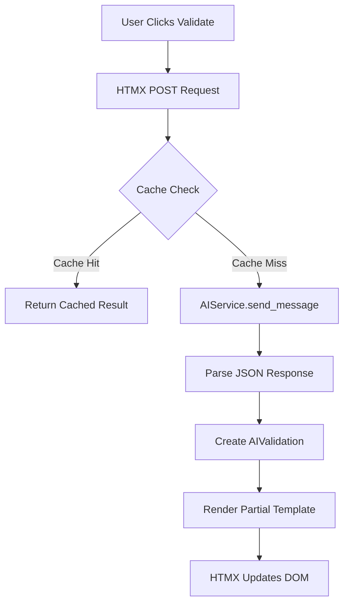

# AI Validation Architecture

> Clean architecture patterns for production AI integration in Django

## Overview

The Excel AI Validation feature (US-008) demonstrates enterprise-grade architecture patterns for integrating AI capabilities into Django applications. This document covers the technical decisions, service abstractions, and design patterns that make this feature maintainable, scalable, and cost-effective.

## Architecture Principles

### 1. Service Layer Abstraction

We leverage the AIService from US-007 rather than directly calling the Anthropic SDK:

```python
# apps/excel_manager/views.py
from apps.core.services.ai_service import AIService

def validate_excel_with_ai(excel_upload):
    """Validate Excel data using AI service."""
    service = AIService()  # Abstraction layer

    # Not this:
    # client = anthropic.Anthropic()  # Direct coupling
```

**Benefits:**

- Vendor flexibility (can swap Claude for GPT-4 without touching views)
- Centralized error handling
- Consistent response format
- Single point for rate limiting

### 2. Model Design with JSONField

The `AIValidation` model uses PostgreSQL's JSONField for maximum flexibility:

```python
class AIValidation(models.Model):
    validation_result = models.JSONField(
        help_text="Structured response: {issues, summary, severity}"
    )
    ai_metadata = models.JSONField(
        default=dict,
        help_text="Stores tokens, cost, model, response_time"
    )
```

**Why JSONField over normalized tables?**

- Schema evolution without migrations
- Preserves full AI response for debugging
- Flexible for different validation types
- Native PostgreSQL JSON operations

### 3. Cost as Computed Property

Cost calculation is a model property, not stored:

```python
@property
def cost(self) -> float:
    """Calculate cost from token usage."""
    tokens = self.ai_metadata.get("tokens", {})
    input_cost = tokens.get("input_tokens", 0) * 0.003 / 1000
    output_cost = tokens.get("output_tokens", 0) * 0.015 / 1000
    return round(input_cost + output_cost, 6)
```

**Advantages:**

- Pricing updates don't require data migration
- Cost calculation logic in one place
- Can adjust pricing per model/tier
- Historical data remains accurate

### 4. Caching Strategy

Intelligent caching with explicit user control:

```python
class ValidateWithAIView(LoginRequiredMixin, View):
    def post(self, request, pk):
        # User can force fresh validation
        force_refresh = request.POST.get("force_refresh") == "true"

        if not force_refresh:
            recent_validation = excel_upload.ai_validations.filter(
                validated_at__gte=timezone.now() - timedelta(hours=1)
            ).first()

            if recent_validation:
                return render(request, 'partials/_ai_validation_result.html', {
                    'validation': recent_validation,
                    'cached': True
                })
```

**Design Decisions:**

- 1-hour cache window (balance between cost and freshness)
- Force refresh button for user control
- Cache indicated in UI for transparency
- Per-file caching (not global)

## HTMX-First Architecture

### Why HTMX over Alpine.js for Server State?

Initial attempt used Alpine.js for state management:

```html
<!-- AVOIDED: Complex state synchronization -->
<div x-data="{ validating: false, hasCached: false }"></div>
```

Final implementation uses HTMX for server communication with minimal Alpine.js for UI state:

```html
<!-- CLEAN: Server manages all state -->
<button
  hx-post=""
  hx-target="#ai-validation-section"
  hx-disabled-elt="this"
></button>
```

**Benefits:**

- Server as single source of truth (data state)
- Alpine.js only for local UI state (button states, collapsibles)
- No client/server data sync issues
- Simpler mental model
- Progressive enhancement friendly

### Partial Template Organization

```
templates/excel_manager/partials/
├── _ai_validation_result.html   # Success state
├── _ai_validation_error.html    # Error handling
└── _ai_validation_loading.html  # Progress indicator
```

Each partial is self-contained and testable.

## Data Flow Architecture



## Security Architecture

### Owner-Only Validation

```python
excel_upload = get_object_or_404(
    ExcelUpload,
    pk=pk,
    user=request.user  # Ownership enforced at query level
)
```

### Data Sanitization

```python
def get_preview_data(self, rows: int = 100):
    """Sample data intelligently, avoiding PII exposure."""
    # Only first 100 rows sent to AI
    # Headers + sample, not full dataset
```

## Performance Optimizations

### 1. Intelligent Data Sampling

Instead of sending entire Excel files:

```python
data_sample = excel_upload.get_preview_data(rows=100)
# ~200 tokens instead of potential thousands
```

### 2. Database Indexing

```python
class Meta:
    indexes = [
        models.Index(fields=["excel_upload", "-validated_at"]),
    ]
```

### 3. Response Format Optimization

Structured prompt ensures concise responses:

```python
VALIDATION_SYSTEM_PROMPT = """Return ONLY valid JSON:
{
  "valid_rows": integer,
  "warning_rows": integer,
  "error_rows": integer,
  "issues": [...],
  "summary": "2-3 sentences max"
}"""
```

## Error Handling Patterns

### Graceful Degradation

```python
if not settings.AI_CONFIG.get("ENABLED", False):
    return render(request, 'partials/_ai_validation_error.html', {
        'error': 'AI features are currently disabled'
    })
```

### Markdown-Wrapped Response Handling

````python
# Claude sometimes wraps JSON in markdown
if "```json" in content:
    content = content.split("```json")[1].split("```")[0].strip()
validation_data = json.loads(content)
````

## Testing Architecture

### Mocked AI Responses

```python
@patch('apps.core.services.ai_service.Anthropic')
def test_validation_success(self, mock_anthropic):
    mock_anthropic.return_value.messages.create.return_value = Mock(
        content='{"valid_rows": 95, "error_rows": 5}',
        usage={'input_tokens': 150, 'output_tokens': 100}
    )
```

### Cost Calculation Tests

```python
def test_cost_calculation(self):
    validation = AIValidation.objects.create(
        ai_metadata={"tokens": {"input_tokens": 1000, "output_tokens": 500}}
    )
    expected = (1000 * 0.003 + 500 * 0.015) / 1000
    assert validation.cost == round(expected, 6)
```

## Deployment Considerations

### Environment Variables

```env
AI_FEATURES_ENABLED=True
ANTHROPIC_API_KEY=sk-ant-...
CLAUDE_MODEL=claude-sonnet-4-20250514
CLAUDE_MAX_TOKENS=1000
```

### Feature Flags

The `AI_FEATURES_ENABLED` flag allows:

- Gradual rollout
- Quick disable in case of issues
- A/B testing
- Cost control in development

## Lessons Learned

### What Worked Well

1. **Service abstraction** - Easy to test and modify
2. **JSONField flexibility** - No migration hell
3. **HTMX simplicity** - Reduced complexity dramatically
4. **Cost transparency** - Builds user trust

### Architecture Wins

1. **Computed properties** over stored calculations
2. **Server-side state** over client-side complexity
3. **Partial templates** for maintainable HTMX
4. **Explicit user control** (force refresh) over magic

## Future Architecture Considerations

### Potential Enhancements

- Message queue for async processing (Celery)
- Redis caching layer for high-traffic
- Multi-model validation comparison
- Streaming responses for large files

### Scaling Patterns

```python
# Future: Background processing
from celery import shared_task

@shared_task
def validate_excel_async(upload_id):
    # Process large files asynchronously
    pass
```

## Conclusion

This architecture provides:

- **Flexibility** through abstraction
- **Reliability** through error handling
- **Performance** through caching
- **Maintainability** through clean separation
- **Cost control** through optimization

The patterns demonstrated here scale from startup to enterprise, making this a production-ready reference implementation for AI integration in Django applications.

---

_Last verified against codebase: 2025-09-20_
