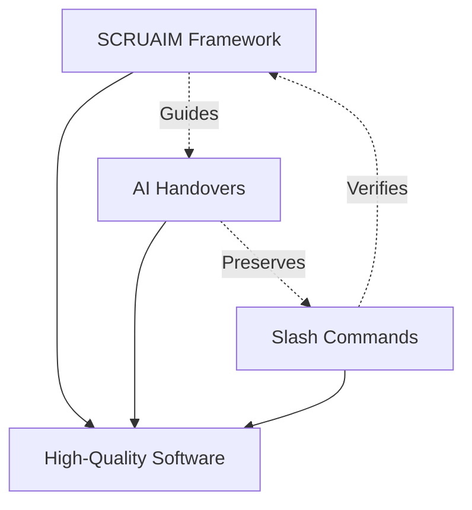

# AI Development Tools & Methodology

This documentation explains the innovative AI-assisted development methodology used to build this Django application. The project was created using three complementary systems that work together to enable rapid, high-quality software development with AI assistance.

## 📚 Documentation Index

1. **[SCRUAIM Framework](./scruaim-framework.md)** - The story-driven development methodology
2. **[AI Handovers](./ai-handovers.md)** - How to maintain continuity across AI sessions
3. **[Slash Commands](./slash-commands.md)** - Deep analysis tools for objective code insights

## Quick Overview

### What Makes This Approach Unique?

This project demonstrates a new paradigm for AI-assisted development that solves three critical challenges:

1. **Systematic Development** - The SCRUAIM framework provides structure through user stories
2. **Context Preservation** - AI handovers maintain knowledge across session boundaries
3. **Objective Analysis** - Slash commands verify reality vs. documentation

### The Three-Pillar System



## How This Project Was Built

### 1. Story-Driven Development (SCRUAIM)

Every feature started as a user story with:

- Clear business value proposition
- Detailed acceptance criteria
- Technical implementation approach
- Comprehensive testing requirements
- Security and performance checklists

**Result**: 7 completed stories, 86% test coverage, enterprise-ready architecture

### 2. Knowledge Preservation (Handovers)

Between AI sessions, detailed handover documents captured:

- Architectural decisions with reasoning
- Failed approaches to avoid repetition
- Performance discoveries and optimizations
- Business context not visible in code

**Result**: Seamless continuity across 6+ development sessions

### 3. Objective Code Analysis (Slash Commands)

Two powerful commands provide:

- **Code Analysis**: Pure implementation truth with zero documentation
- **Documentation Verification**: Accuracy checking against actual code

**Result**: 93.5% documentation accuracy, objective metrics, actionable insights

## Getting Started

### For Developers

1. **Understand the methodology**: Read the SCRUAIM framework documentation
2. **Review past decisions**: Check handovers in `.claude/handovers/`
3. **Verify assumptions**: Run slash commands for objective analysis

### For AI Assistants

1. **Check for handovers**: Always read the latest handover for context
2. **Follow SCRUAIM**: Create user stories before implementing features
3. **Use slash commands**: Verify documentation claims against code

## Project Metrics

These metrics were generated through objective code analysis:

- **Lines of Code**: ~2,500 (application code)
- **Test Coverage**: 86% (1,848 statements)
- **Django Apps**: 5 (authentication, core, dashboard, excel_manager, users)
- **User Stories Completed**: 7
- **Development Sessions**: 6+ (with handovers)
- **Documentation Accuracy**: 93.5%

## Key Success Factors

### 1. Systematic Approach

Every feature follows the same rigorous story template with business value, technical approach, and quality criteria.

### 2. Enterprise Standards

Built-in quality gates ensure production readiness:

- Minimum 70% test coverage (exceeded with 86%)
- Security checklists for every story
- Performance requirements defined upfront

### 3. Continuous Learning

The system captures and preserves insights:

- Failed approaches documented to prevent repetition
- Performance discoveries shared across sessions
- Architectural decisions explained with reasoning

### 4. Objective Truth

"Code is truth, documentation is hope" - slash commands ensure claims match reality.

## Tools Location

All AI development tools are organized in:

```
.claude/
├── scruaim/           # Framework and user stories
│   ├── user-stories/  # Story pipeline (draft → todo → done)
│   └── backlog/       # Project tracking
├── handovers/         # Session continuity documents
├── commands/          # Slash command definitions
└── analysis/          # Generated analysis outputs
```

## Next Steps

### To Continue Development

1. Read the latest handover in `.claude/handovers/`
2. Check todo stories in `.claude/scruaim/user-stories/todo/`
3. Run code analysis to understand current state
4. Create new user story for next feature
5. Implement following SCRUAIM guidelines
6. Create handover before context reset

### To Analyze the Codebase

1. Run `/django-code-analysis` for objective metrics
2. Run `/django-docs-analysis` to verify documentation
3. Review generated reports in `.claude/analysis/`
4. Update documentation based on findings

## Philosophy

This methodology embodies three core principles:

1. **Evidence over Assumptions** - Always verify against actual code
2. **Structure enables Speed** - Rigorous process accelerates quality delivery
3. **Knowledge is Power** - Preserved context prevents repeated mistakes

The combination of SCRUAIM's structure, handovers' continuity, and slash commands' objectivity creates a powerful framework for AI-assisted development that produces enterprise-quality software rapidly and reliably.

---

_For detailed information about each component, see the individual documentation files in this directory._
