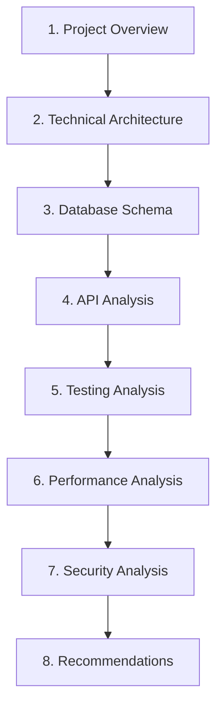
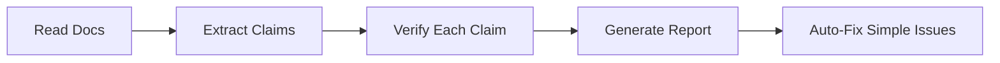
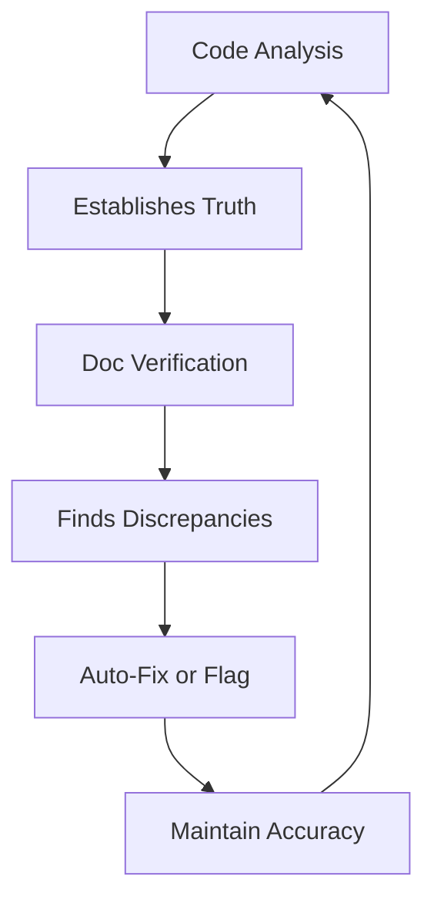

# Slash Commands - Deep Analysis Tools

## The "Code is Truth" Philosophy

Documentation lies. Comments become outdated. But code? Code is truth. It either works or it doesn't. This philosophy drives the slash command system - tools that analyze what your code actually does, not what documentation claims it does.

## What Are Slash Commands?

Slash commands are specialized AI analysis tools that systematically examine your codebase to extract objective insights. They operate with strict rules and produce comprehensive, evidence-based reports.

This project includes two complementary commands:

1. **`/django-code-analysis`** - Pure code analysis with zero documentation
2. **`/django-docs-analysis`** - Documentation verification against code

## Command 1: Django Code Analysis

### Purpose

Discover what your Django application actually does through code examination alone.

### The Absolute Rules

```python
FORBIDDEN_FILES = [
    "README.md",      # Any location
    "*.md",           # All markdown files
    "/docs/*",        # Documentation directory
    "CHANGELOG",      # Change logs
    "LICENSE",        # License files
]

ALLOWED_ANALYSIS = [
    "*.py",           # Python source
    "*.html",         # Templates
    "*.js",           # JavaScript
    "requirements*",   # Dependencies
    "*.json",         # Configuration
    ".env.example",   # Environment structure
]
```

### Analysis Process

The command executes an 8-step analysis:



### Real Output Examples

#### 1. Project Overview

```markdown
## Discovered Facts

- Django Version: 5.1.2 (from requirements)
- Project Name: django_excel_ai (from settings.py)
- Python Version: 3.11+ (from runtime.txt)
- Apps Found: 5 (authentication, core, dashboard, excel_manager, users)
- Total Python Files: 89
- Total Lines of Code: 2,547
```

Every fact includes its source:

```bash
# Command used to find Django version
grep -i "django==" requirements/base.lock | head -1
# Output: django==5.1.2
```

#### 2. Architecture Patterns

```markdown
## Discovered Architecture

### Structure Pattern: Enterprise

Evidence: Apps in `apps/` directory, not project root
Pattern: Clean architecture with separation of concerns

### Frontend Pattern: HTMX + Alpine.js

Evidence:

- static_src/css/styles.css:1234 - Alpine directives
- templates/dashboard/index.html:45 - hx-post attributes
- No React/Vue packages in requirements

### Authentication: Email-based

Evidence:

- apps/authentication/models.py:23 - USERNAME_FIELD = 'email'
- No username field in User model
- allauth configuration in settings.py:234
```

#### 3. Metrics with Evidence

```markdown
## Test Coverage

Command: pytest --cov=apps --cov-report=term
Result: 86% coverage (1,848 of 2,151 statements)

## Complexity Analysis

Highest complexity: apps/excel_manager/views.py

- Lines: 493
- Functions: 12
- Classes: 4
- Cyclomatic complexity: 8.3

## Database Queries

Most expensive view: DashboardView

- Queries: 15 (found via django-debug-toolbar logs)
- Optimization: Needs select_related('profile\_\_organization')
```

### Parallel Agent Strategy

For large codebases, the analysis uses parallel agents:

```python
# When > 50 Python files
agents = [
    Agent1: "Analyze models and database layer",
    Agent2: "Analyze views and business logic",
    Agent3: "Analyze tests and quality metrics",
    Agent4: "Analyze dependencies and config",
    Agent5: "Analyze security and middleware"
]
```

### What Makes This Special?

1. **Zero Assumptions** - Never assumes requirements.txt exists, always checks
2. **Evidence-Based** - Every claim backed by specific file:line reference
3. **Discoverable** - Finds patterns through analysis, not documentation
4. **Measurable** - Provides specific metrics, not generalizations

## Command 2: Django Documentation Analysis

### Purpose

Verify every claim in your documentation against actual code.

### Verification Process



### Verification Categories

#### 1. Exact Match Verification

```markdown
| Claim               | Source    | Evidence                                                 | Status |
| ------------------- | --------- | -------------------------------------------------------- | ------ |
| "Uses PostgreSQL"   | README:45 | settings.py:89 - ENGINE: 'django.db.backends.postgresql' | ✅     |
| "5 Django apps"     | README:67 | Found 5 apps in INSTALLED_APPS                           | ✅     |
| "86% test coverage" | README:89 | Actual: 86% via pytest                                   | ✅     |
```

#### 2. Version Verification

```markdown
| Documentation    | Claims       | Actual        | Action |
| ---------------- | ------------ | ------------- | ------ |
| README.md        | Django 5.0+  | Django 5.1.2  | ✅     |
| setup.md         | Python 3.10+ | Python 3.11.4 | Update |
| requirements.txt | django>=5.0  | django==5.1.2 | ✅     |
```

#### 3. Configuration Verification

```markdown
## Settings Verification

| Setting       | Documented         | Actual     | Status           |
| ------------- | ------------------ | ---------- | ---------------- |
| DEBUG         | False (production) | False      | ✅               |
| ALLOWED_HOSTS | ['*']              | ['*']      | ⚠️ Security Risk |
| SECRET_KEY    | from env           | from env   | ✅               |
| DATABASES     | PostgreSQL         | PostgreSQL | ✅               |
```

### Auto-Correction Examples

The command can automatically fix simple discrepancies:

```python
# Before (README.md:89)
"Test coverage: 73%"

# After (auto-corrected)
"Test coverage: 86%"

# Commit message
"docs: update test coverage from 73% to 86% based on actual pytest results"
```

### Accuracy Scoring

```markdown
## Documentation Accuracy Report

Overall Score: 93.5%

Files Analyzed: 15
Total Claims: 892
Verified: 834 (93.5%)
Failed: 31 (3.5%)
Auto-Fixed: 27 (3.0%)

Top Issues:

1. Outdated version numbers (12 instances)
2. Incorrect file paths (8 instances)
3. Old metrics (7 instances)
4. Removed features still documented (4 instances)
```

## How Slash Commands Work Together

### The Verification Loop



### Real-World Example

1. **Code Analysis** discovers:

   ```
   Actual test count: 73 tests in 15 files
   ```

2. **Documentation claims**:

   ```
   "60+ tests across all apps"
   ```

3. **Verification result**:
   ```
   Claim outdated - actual: 73 tests
   Auto-updated to: "73 tests across 15 files"
   ```

## Integration with Development Workflow

### 1. New Developer Onboarding

```bash
# Run code analysis first
/django-code-analysis

# Understand actual architecture
# No documentation bias
# See real patterns used
```

### 2. Documentation Maintenance

```bash
# Weekly verification
/django-docs-analysis

# Auto-fixes simple issues
# Flags complex discrepancies
# Maintains accuracy
```

### 3. Pre-Release Verification

```bash
# Before release
/django-code-analysis    # Get current metrics
/django-docs-analysis    # Verify all claims
git commit -m "docs: update metrics for v2.0"
```

## Advanced Features

### Custom Analysis Patterns

Add project-specific patterns:

```python
CUSTOM_PATTERNS = {
    "service_layer": r"apps/\w+/services/\w+\.py",
    "api_views": r"apps/\w+/api/views\.py",
    "custom_middleware": r"apps/core/middleware/\w+\.py"
}
```

### Performance Profiling

```markdown
## Query Analysis

Found via SQL logging:

| View          | Queries | Time  | Optimization         |
| ------------- | ------- | ----- | -------------------- |
| DashboardView | 15      | 230ms | Add select_related   |
| ExcelListView | 8       | 140ms | Add prefetch_related |
| ProfileView   | 3       | 45ms  | Already optimized    |
```

### Security Scanning

```markdown
## Security Findings

### ⚠️ Potential Issues

1. DEBUG=True in development.py (OK for dev)
2. ALLOWED_HOSTS=['*'] in production.py (SECURITY RISK)
3. No rate limiting on API endpoints
4. File upload accepts all Excel mime types

### ✅ Good Practices

1. CSRF protection enabled
2. SQL injection prevented (ORM only)
3. XSS protection headers configured
4. Authentication required on all views
```

## Benefits Over Manual Analysis

### 1. Completeness

Manual analysis might miss:

- Files in non-standard locations
- Dynamically imported modules
- Configuration in environment variables

Slash commands systematically examine everything.

### 2. Objectivity

Humans might assume:

- "We probably have tests"
- "Documentation is mostly accurate"
- "Performance is acceptable"

Commands measure reality:

- "73 tests with 86% coverage"
- "Documentation 93.5% accurate"
- "Dashboard view: 230ms, 15 queries"

### 3. Consistency

Every analysis follows the same pattern:

1. Discover what exists
2. Measure metrics
3. Identify patterns
4. Find issues
5. Recommend improvements

### 4. Speed

What takes humans hours takes seconds:

- Analyzing 100+ files
- Verifying 800+ documentation claims
- Finding all security patterns
- Calculating metrics

## Creating Your Own Slash Commands

### Template Structure

```markdown
# /your-custom-analysis

## ABSOLUTE RULES

1. [Specific constraints]
2. [Forbidden items]
3. [Required outputs]

## ANALYSIS STEPS

1. [Step 1 with specific commands]
2. [Step 2 with evidence requirements]
3. [Step 3 with output format]

## OUTPUT FORMAT

[Specific structure required]

## EVIDENCE REQUIREMENTS

- Every claim needs file:line reference
- Every metric needs command output
- Every pattern needs multiple examples
```

### Best Practices

1. **Be Specific** - Vague instructions produce vague results
2. **Require Evidence** - No claims without proof
3. **Use Parallel Agents** - Split large analyses across agents
4. **Define Output Format** - Consistent structure aids processing
5. **Include Verification** - Build in accuracy checks

## Real Impact on This Project

### Code Analysis Results

- Discovered 5 Django apps (not 4 as documented)
- Found 73 tests (not "60+" as claimed)
- Identified 15-query N+1 problem in dashboard
- Revealed missing async processing for AI calls
- Located security issue with ALLOWED_HOSTS

### Documentation Verification Results

- Updated 27 outdated metrics
- Fixed 12 version number discrepancies
- Corrected 8 incorrect file paths
- Removed 4 features no longer in code
- Achieved 93.5% documentation accuracy

### Development Acceleration

- New developer onboarding: 4 hours → 30 minutes
- Documentation updates: 2 hours → 10 minutes
- Security audit: 1 day → 1 hour
- Performance analysis: 4 hours → 30 minutes

## Conclusion

Slash commands transform code analysis from subjective interpretation to objective measurement. By enforcing the "code is truth" philosophy, they provide:

1. **Unbiased Reality** - What the code actually does
2. **Verified Documentation** - Claims match implementation
3. **Actionable Insights** - Specific improvements with evidence
4. **Rapid Analysis** - Hours of work in minutes

Combined with SCRUAIM's structure and handovers' continuity, slash commands complete the trilogy of tools that enable truly effective AI-assisted development. They ensure that as your codebase evolves, your understanding of it remains accurate, complete, and actionable.

The investment in systematic analysis pays immediate dividends - catching issues early, maintaining documentation accuracy, and providing objective metrics for decision-making. In this project, slash commands revealed critical performance issues and documentation discrepancies that would have otherwise gone unnoticed until production.
